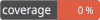

# Aegisora Required Rule

[](https://packagist.org/packages/aegisora/required-rule)
[](https://packagist.org/packages/aegisora/required-rule)

[](LICENSE)


Required Rule provides a simple, rule-based presence validation implementation for the Aegisora ecosystem.

It is built on top of [`aegisora/rule-contract`](https://github.com/Aegisora/rule-contract) and follows its strict validation architecture, ensuring consistent and predictable behavior across applications.

This rule is useful for asserting that a required field is present before it is processed — form fields, API request parameters, configuration values, message queue payloads, and any other value that must not be `null`.

---

## 📑 Table of Contents
- [Features](#-features)
- [Installation](#-installation)
- [Core Concept](#-core-concept)
- [Basic Usage](#-basic-usage)
- [Valid vs Invalid](#-valid-vs-invalid)
- [Validation Result](#-validation-result)
- [Guardian Usage](#-guardian-usage)
- [Real-World Examples](#-real-world-examples)
- [Factory Methods](#-factory-methods)
- [Architecture](#-architecture)
- [License](#-license)
- [Contributing](#-contributing)
- [Support](#-support)

---

## ✨ Features
- 🔹 Lightweight and dependency-free except `aegisora/rule-contract`
- 🔹 Validates whether a value is present (not `null`)
- 🔹 Accepts any non-null value (strings, numbers, booleans, arrays, objects, callables)
- 🔹 Treats `0`, `false`, `''` and `[]` as present — only `null` is rejected
- 🔹 Fully compatible with Aegisora validation pipeline
- 🔹 Strict `Context` → `Result` validation flow
- 🔹 No raw booleans — only structured results
- 🔹 Safe execution via base `Rule` abstraction
- 🔹 Simple factory API (create)
- 🔹 Ready to use out of the box

---

## 📦 Installation

```bash
composer require aegisora/required-rule
```

---

## 🚀 Core Concept

This package implements a single validation rule:

- accepts a value via `Context`
- checks whether the value is present (not `null`)
- returns a standardized `Result`

Under the hood it wraps the common boilerplate:

```php
if ($value === null) {
    // value is missing
}
```

into a reusable rule that reports its outcome through a `Result` object instead of a raw boolean.

---

## 🏗️ Basic Usage

```php
use Aegisora\RuleContract\Models\Context;
use Aegisora\Rules\RequiredRule;

$result = RequiredRule::create()->validate(Context::create('Aegisora'));

if ($result->isValid()) {
    // value is present
} else {
    // value is missing
}
```

---

## ✅ Valid vs Invalid

The rule passes for any non-null value and fails only when the value is `null`. Falsy values such as `0`, `false`, `''` and `[]` are still considered present.

### Valid values

```php
$rule = RequiredRule::create();

$rule->validate(Context::create('foo'));        // valid
$rule->validate(Context::create(''));           // valid — empty string is present
$rule->validate(Context::create(0));            // valid — zero is present
$rule->validate(Context::create(false));        // valid — false is present
$rule->validate(Context::create([]));           // valid — empty array is present
$rule->validate(Context::create([1, 2, 3]));    // valid
$rule->validate(Context::create(new stdClass()));// valid
```

### Invalid values

```php
$rule = RequiredRule::create();

$rule->validate(Context::create(null));         // invalid — value is missing
```

---

## 🧪 Validation Result

If the value is present, the rule returns a valid result.

`$result->isValid(); // true`

If the value is `null`, the rule returns an invalid result.

```php
$result->isValid(); // false
$result->getFailedRuleCode(); // required_rule
```

---

## 🔗 Guardian Usage

This rule can be used together with `aegisora/guardian` to build fluent validation pipelines.

```php
use Aegisora\Guardian\Guardian;
use Aegisora\Rules\RequiredRule;
use App\Exceptions\MissingFieldException;

$guardian = new Guardian();

$guardian
    ->that($fieldValue)
    ->must(RequiredRule::create(), new MissingFieldException())
    ->validate();
```

If the value is missing, `Guardian` throws the provided domain exception.

---

## 🧭 Real-World Examples

Required Rule is useful for asserting that a value is present before it is processed or persisted.

Examples

```text
Form:

validate that a required field was submitted
```
```text
API Gateway:

reject requests missing a mandatory parameter
```
```text
Configuration:

ensure a required config value is provided
```
```text
Message Queue:

validate that a required payload field is present
```

---

## 🧩 Factory Methods
`RequiredRule::create();`
- no arguments — creates a new rule instance

`RequiredRule::create()->validate($context);`
- `$context` — `Context` wrapping the value to validate

---

## 🏛️ Architecture

This package relies on [`aegisora/rule-contract`](https://github.com/Aegisora/rule-contract).

Flow:
1. `validate()` is called
2. `Context` is passed in
3. The value is extracted from context
4. The value is checked for presence (`!== null`)
5. `Result` is returned — valid when present, invalid with the `required_rule` code when `null`

All logic is safely handled by Rule contract.

---

## ⚖️ License

This package is open-source and licensed under the MIT License. See the [LICENSE](LICENSE) for details.

---

## 🌱 Contributing

Contributions are welcome and greatly appreciated! See the [CONTRIBUTING](CONTRIBUTING.md) for details.

---

## 🌟 Support

If you find this project useful, please consider giving it a star on GitHub!

It helps the project grow and motivates further development.
